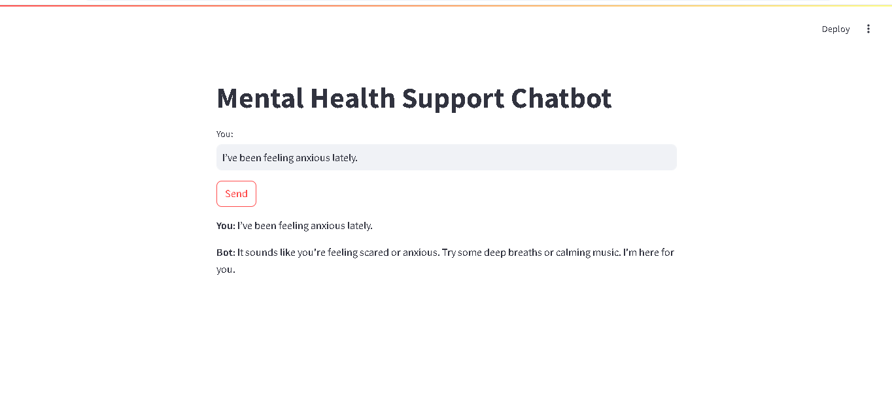

# Mental Health Support Chatbot

A supportive chatbot designed to provide mental health assistance through empathetic conversations, sentiment analysis, and helpful resources.

---

## Features

- Natural language understanding to provide empathetic responses
- Sentiment analysis to track user emotions during the conversation
- Conversation logging (with user consent) for emotional tracking over time
- Real-time chat interface built with Streamlit
- Emergency helpline resources for crisis situations
- Modular design with classifiers and logging for better maintainability

---

## Project Structure
- classifier.py: Sentiment and intent classification module
- logger.py: Logging module for conversation and events
- streamlit_app.py: Main Streamlit application script
- main.py: Core chatbot logic
- resources.py: Data and resource files
- requirement.txt: Python dependencies
- .gitattributes: Git attributes for line endings
- .gitignore: Git ignored files
- venv/: Virtual environment (excluded from Git)
- images/:
  - chatbot-ui.png: Screenshot of chatbot UI
 
## Installation
  **steps:**
    - **step: Clone the repository**  
     *commands:*  
        - git clone https://github.com/Vaishnavisarode/Mental_Health_Support_chatboard.git  
        - cd mental-health-chatbot  
    - **step: Create and activate a virtual environment**  
      *commands:*   
        - python -m venv venv  
        - venv\Scripts\activate  # For Windows  
        - source venv/bin/activate  # For macOS/Linux  
    - **step: Install dependencies**  
      *commands:*  
        - pip install -r requirement.txt 
## usage:
  command: streamlit run streamlit_app.py.  
  note: This will open the chatbot UI in your default browser.
  
## screenshots:
  Example of the chatbot interface
  
